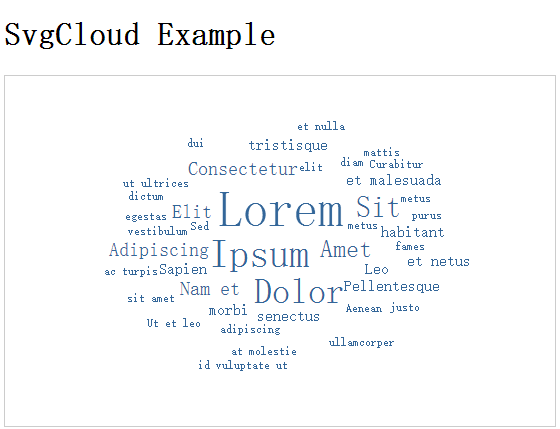

# svgCloud
一个借助svg技术的词云生成插件,更有支持动态改变的词云，[请戳]()

## 功能特点
### v1版本
- 利用svg生成词云
- 支持jQuery插件版本
- 内置简单的jQuery兼容函数，支持非插件版本
- 效果如下


## directory
### svg_cloud_v1_jquery
支持jQuery版本
#### 使用方法
1. 引入jquery和svgcloud的js文件
```
<script type="text/javascript" src="jquery.js"></script>
<script type="text/javascript" src="svgcloud-1.0.0.js"></script>
```
2. 数据格式如下
```
var word_list = [
    {text: "Dolor", weight: 9.4},
    {text: "Sit", weight: 8}
];
```
3. 调用插件,selector为生成词语你的dom节点，word_list为数据内容，font_color是字体颜色配置_
```
$(selector).SvgCloud(word_list, {font_color: color});
```
4. svg_cloud_v1_jquery的index.html是一个demo

### svg_cloud_v1
不支持jQuery版本
#### 使用方法
1. 引入jquery和svgcloud的js文件
```
<script type="text/javascript" src="svgcloud-1.0.0.js"></script>
```
2. 数据格式如下
```
var word_list = [
    {text: "Dolor", weight: 9.4},
    {text: "Sit", weight: 8}
];
```
3. 调用插件,selector为生成词语你的dom节点，word_list为数据内容，font_color是字体颜色配置_
```
$(selector).SvgCloud(word_list, {font_color: color});
```
4. svg_cloud_v1的index.html是一个demo
